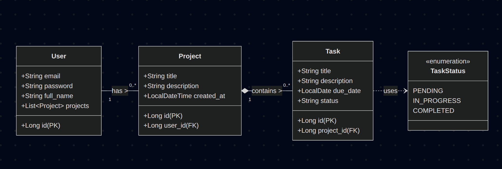
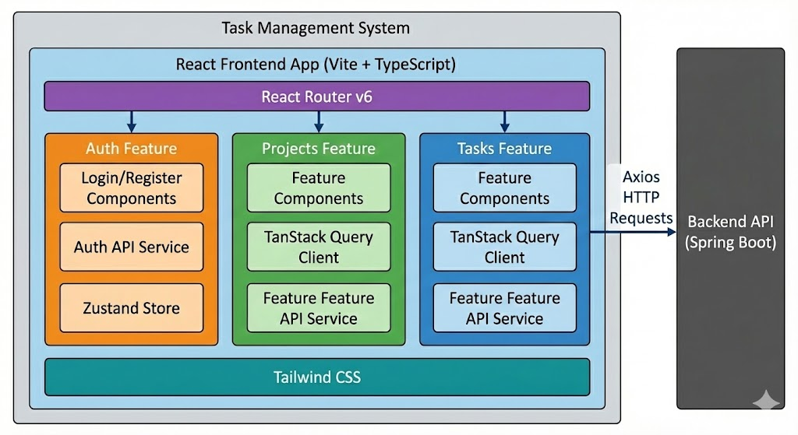
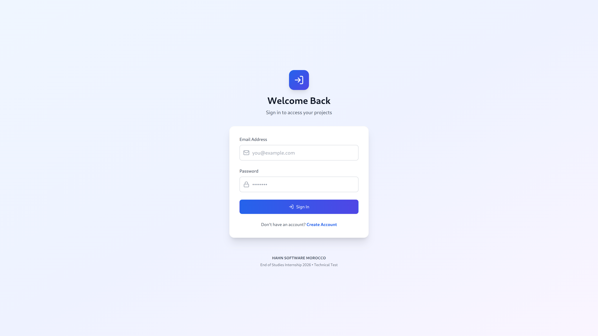
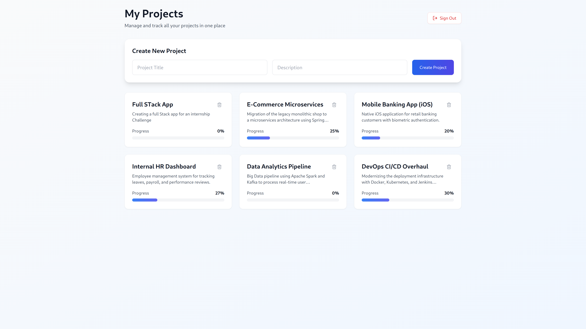
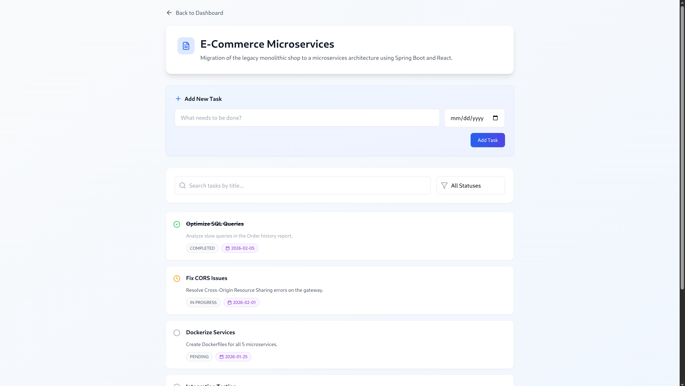

# 🚀 Task Management System
### Hahn Software Morocco — End of Studies Internship 2026

## 🛠 Tools & Technologies Used

### Backend


### Frontend


### DevOps & Infrastructure


---

## 📖 Project Overview

This **Full Stack Task Management System** was designed and built as a technical test for the **Hahn Software** internship program. It addresses the need for a robust project tracking tool where users can create projects, assign tasks, and visualize progress in real-time.

The application follows a **Microservice-ready Monolithic Architecture**, ensuring that the codebase is modular, scalable, and easy to maintain.

---

## 🏗️ Architecture & Design Choices

### 1. Backend Architecture (Spring Boot)
The backend is built using a **Layered Architecture** to enforce separation of concerns.
* **Controller Layer:** Handles HTTP requests and response formatting.
* **Service Layer:** Contains business logic (e.g., calculating progress, validating due dates).
* **Repository Layer:** Manages data persistence with MySQL using JPA/Hibernate.
* **Security:** Stateless authentication using **JWT** filters.

#### 📐 Class Diagram (UML)
Below is the core domain model representing the relationship between Users, Projects, and Tasks.




### 2. Frontend Architecture (React)
The frontend uses a **Feature-Based Folder Structure**, keeping all logic related to a feature (API, Components, Types) in one place.



* **State Management:**
    * **Zustand:** Used for global client state (Authentication, User Profile) due to its lightweight nature.
    * **TanStack Query:** Used for server state (Projects, Tasks). It handles caching, background refetching, and loading states automatically, replacing complex `useEffect` chains.
* **Routing:** React Router v6 protected routes (redirects to Login if no token exists).

### 3. DevOps Strategy (Docker & Nginx)
The application is fully containerized to ensure it runs identically on any machine.
* **Nginx Reverse Proxy:** Serves the React static files and forwards `/api` requests to the Backend container. This mimics a real production environment and eliminates CORS issues.
* **Docker Compose:** Orchestrates the database, backend, and frontend containers with a single command.

---

## 📸 UI Screenshots

### Login/Register Page  


### Dashboard & Project List


### Task Management & Editing
*(Add a screenshot of the Task List with the Edit Form open)*


---

## 🚀 Getting Started

You can run this project in two ways: using **Docker (Recommended)** or **Manually**.

### Option 1: Quick Start with Docker 🐳
This requires Docker and Docker Compose to be installed.

1.  **Clone the repository**
    ```bash
    git clone https://github.com/Salahjb/Hahn_project
    cd Hahn_project
    ```

2.  **Run the application**
    ```bash
    docker compose up --build -d
    ```

3.  **Access the App**
    * Frontend: [http://localhost](http://localhost)
    * Backend API: [http://localhost:8080/api](http://localhost:8080/api)

### Option 2: Manual Setup 💻

#### Backend
1.  Navigate to `hahn_backend`.
2.  Update `application.properties` with your local MySQL credentials.
3.  Run:
    ```bash
    ./mvnw spring-boot:run
    ```

#### Frontend   
1.  Navigate to `hahn_frontend`.
2.  Install dependencies and run:
    ```bash
    npm install
    npm run dev
    ```
3.  *Note:* In manual mode, ensure `src/lib/axios.ts` points to `http://localhost:8080/api`.

---

## ✅ Key Features Implemented

- [x] **Secure Auth:** JWT Login & Registration with BCrypt hashing.
- [x] **Projects:** Create projects and view real-time progress calculations.
- [x] **Tasks:** CRUD operations with Status workflow (Pending → In Progress → Completed).
- [x] **Validation:** Backend & Frontend validation (e.g., prevent past due dates).
- [x] **UX:** Inline editing, loading skeletons, and responsive design.

---

## 👤 Author

**Salaheddine Eljably**
* **Role:** Full Stack Developer
* **Context:** Hahn Software Morocco Internship Test 2026
* **LinkedIn:** [Salaheddine Eljably](https://www.linkedin.com/in/salaheddine-eljably-95aab0288/)

